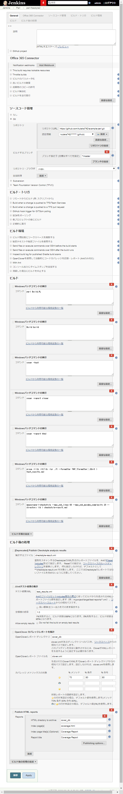
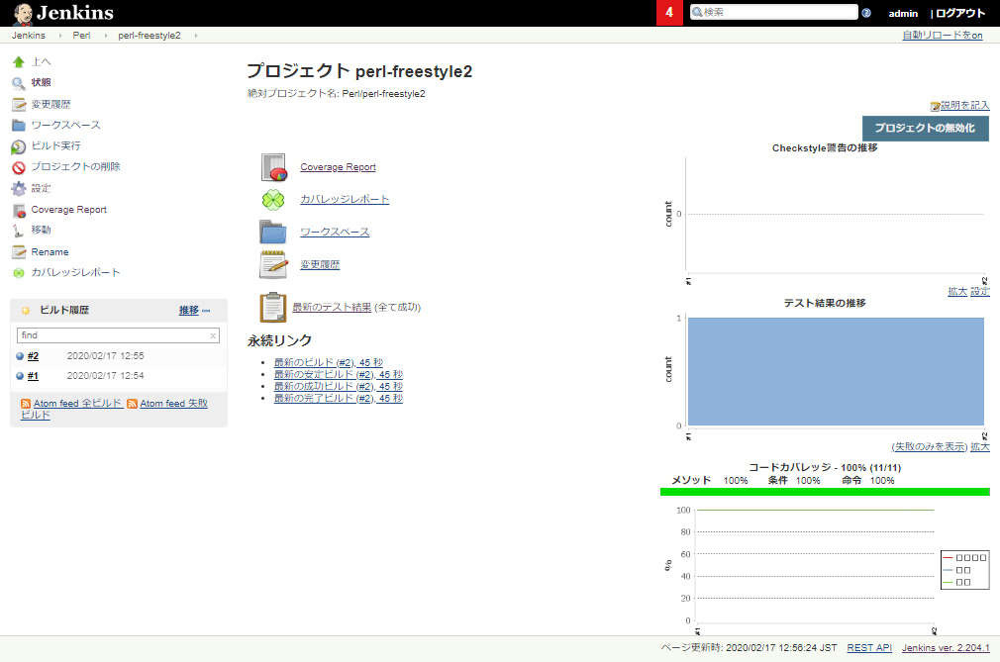

# Perlカバレッジ取得自動化
SonarQubeでカバレッジや静的解析結果を管理する場合には別途設定が必要だが、本設定はJenkins上での管理を行う場合。また、Windowsでの設定となっているためLinuxの場合には必要に応じて読み替えること。

## 環境構築
### Jenkins
1. Jenkinsインストール

1. Jenkinsプラグイン追加
最低でも下記プラグインを追加
 - htmlpublisher
 - checkstyle (静的解析を取る場合)

### Perl
1. strawberryperlをインストール  
http://strawberryperl.com/

1. 追加モジュールをインストール
 - Devel::Cover::Report::Codecov
 - TAP::Formatter::JUnit
 - Devel::Cover::Report::Clover
 - Perl::Metrics::Lite (静的解析を取る場合)

## サンプル実行
### リポジトリ
GitHubの下記リポジトリを使用する。  
(アカウント認証なしにcloneは可能)  
https://github.com/kutaka742/example-perl.git

### Jenkinsジョブ設定

### Jenkinsジョブ結果

